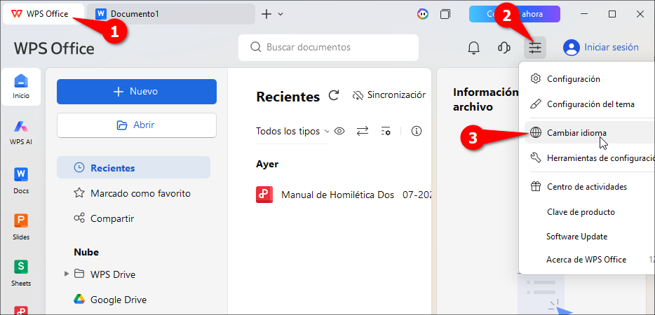
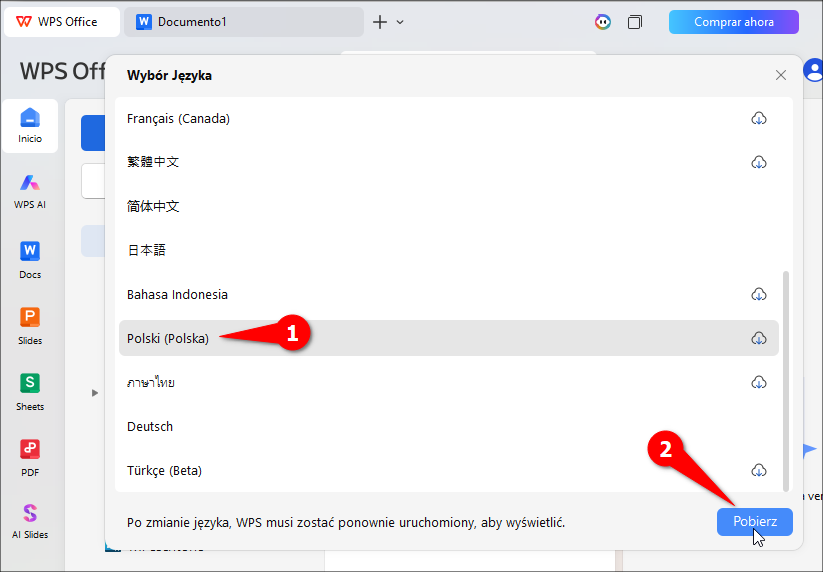
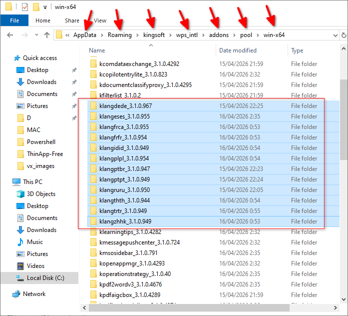
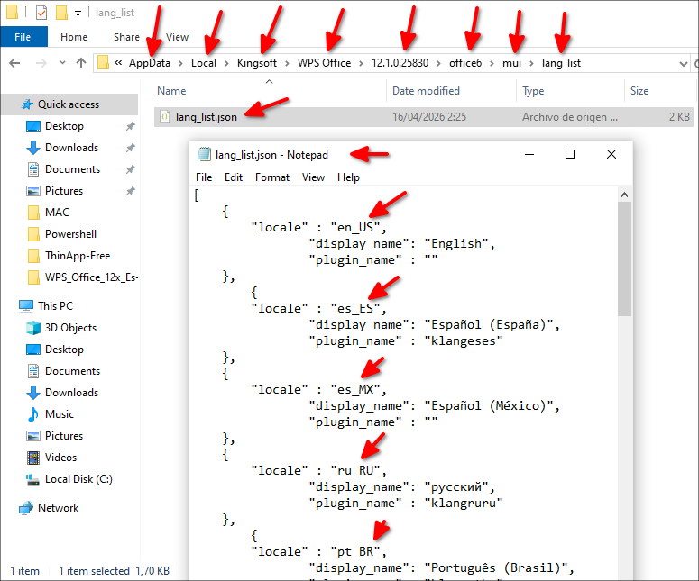
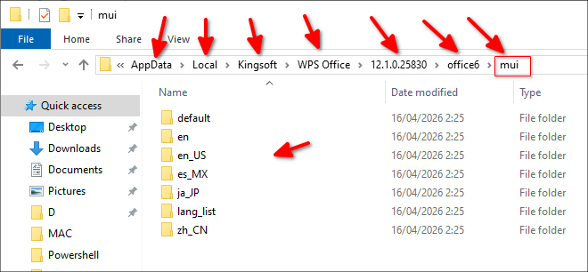

# WPS Office 12.x en español para Linux

Este repositorio sirve para poner **WPS Office 12.x** en **español** en Linux.

Aqui vas a encontrar dos cosas:

- `mui/`: archivos que traducen la interfaz del programa.
- `spellcheck/`: diccionarios para la correccion ortografica.

La idea es simple:

1. Instalas WPS Office.
2. Copias los archivos de idioma.
3. Copias los diccionarios para que funcione el corrector ortografico.
4. Cambias la configuracion para que WPS arranque en español.


## Que necesitas antes de empezar

- Tener **WPS Office 12.x** instalado.
- Tener permisos de administrador con `sudo`.
- Tener este repositorio descargado o clonado en tu computadora.
- Haber abierto **WPS Office al menos una vez**.

Importante:

- El archivo `~/.config/Kingsoft/Office.conf` normalmente **se crea cuando abres WPS por primera vez**.
- Si ese archivo no existe, abre WPS, cierralo, y luego continua con el tutorial.

## Que significa cada ruta

Si estas empezando en Linux, esto te ayudará. En WPS Office la versión 12 descargada desde la página china:

- `/opt/kingsoft/wps-office/office6/mui/`
  Aqui WPS guarda los archivos de idioma de la interfaz.
- `/opt/kingsoft/wps-office/office6/dicts/spellcheck/`
  Aqui WPS guarda los diccionarios del corrector ortografico.
- `~/.config/Kingsoft/Office.conf`
  Aqui WPS guarda la configuracion del usuario.

## Paso 1: instala WPS Office

Descarga el instalador de WPS Office para tu distribucion Linux.

Sitio oficial de la página china:

- [https://www.wps.cn](https://www.wps.cn)

Luego instala el paquete.

Si usas Debian, Ubuntu, Linux Mint o similares:

```bash
sudo dpkg -i wps-office*.deb
```

Si usas Fedora, Red Hat o similares:

```bash
sudo dnf install wps-office*.rpm
```

## Paso 2: copia los archivos del idioma español

Desde la carpeta de este repositorio, ejecuta:

```bash
sudo cp -r mui/* /opt/kingsoft/wps-office/office6/mui/
```

Que hace este comando:

- Copia `es_ES` y `es_MX` dentro de la carpeta de idiomas de WPS.
- Eso permite que WPS tenga disponibles los archivos de interfaz en español.

## Paso 3: cambia la configuracion para que WPS abra en español

Abre el archivo de configuracion del usuario:

```bash
nano ~/.config/Kingsoft/Office.conf
```

o usa Gedit (instalalo) para más comodidad:

```bash
gedit ~/.config/Kingsoft/Office.conf
```

**Nota:** También puedes usar otro editor de texto, solo cambia gedit por su nombre.

Borra todo lo que tenga y deja este solo contenido:

```ini
[General]
languages=es_ES

[6.0]
common\DefaultLanguage=3082
common\Local\UILanguage=3082
wpsoffice\Application%20Settings\AppComponentMode=prome_independ
wpsoffice\Application%20Settings\AppComponentModeInstall=prome_independ
```

**Nota:** No te preocupes por borrar todo el contenido, luego al iniciar el programa WPS Office creará lo que faltaba.

Que hace esta configuracion:

- `languages=es_ES`
  Le dice a WPS que use español de España como idioma principal.
- `DefaultLanguage=3082` y `UILanguage=3082`
  Fuerzan la interfaz grafica en español.
- `AppComponentMode=prome_independ`
  Hace que WPS use el modo de ventanas que funciona mejor con esta configuracion.

Guarda el archivo en `nano` con:

1. `Ctrl + O`
2. `Enter`
3. `Ctrl + X`

En Gedit dale al botón Guardar

## Paso 4: copia los diccionarios para la correccion ortografica

En este manual, los diccionarios se instalan en la ruta global de WPS dentro de `/opt`.

Estando ubicado en una terminal desde la carpeta de este repositorio, ejecuta:

```bash
sudo cp -r spellcheck/* /opt/kingsoft/wps-office/office6/dicts/spellcheck/
```

Que hace este comando:

- Copia los diccionarios de español a la carpeta que usa WPS para revisar ortografia.
- Permite activar variantes como `es_ES`, `es_MX`, `es_EC`, etc.

## Paso 5: cierra y vuelve a abrir WPS Office

Si WPS estaba abierto, cierralo por completo y vuelve a iniciarlo.

Si todo salio bien:

- la interfaz aparecera en español
- el menu de correccion ortografica mostrara opciones de español

## Resultado esperado

Cuando termines, WPS deberia verse en español:


## Como activar la correccion ortografica en español

Despues de copiar los diccionarios, abre WPS Writer y revisa las opciones de idioma o correccion ortografica.

Las siguientes imagenes muestran la parte visual del proceso:


## Si algo no funciona

Revisa estas 5 cosas:

1. Abriste WPS al menos una vez antes de editar `Office.conf`.
2. Copiaste `mui/*` en `/opt/kingsoft/wps-office/office6/mui/`.
3. Copiaste `spellcheck/*` en `/opt/kingsoft/wps-office/office6/dicts/spellcheck/`.
4. El archivo `Office.conf` quedo exactamente como aparece en este tutorial.
5. Cerraste y abriste WPS otra vez despues de hacer los cambios.

## Resumen rapido

Si ya entendiste el proceso y solo quieres los comandos (estando ubicado en una terminal en la carpeta de este repositorio):

```bash
sudo cp -r mui/* /opt/kingsoft/wps-office/office6/mui/
sudo cp -r spellcheck/* /opt/kingsoft/wps-office/office6/dicts/spellcheck/
nano ~/.config/Kingsoft/Office.conf
```

Contenido de `Office.conf`:

```ini
[General]
languages=es_ES

[6.0]
common\DefaultLanguage=3082
common\Local\UILanguage=3082
wpsoffice\Application%20Settings\AppComponentMode=prome_independ
wpsoffice\Application%20Settings\AppComponentModeInstall=prome_independ
```

# Dónde se descargan los idiomas en Windows

Primero descarga e instala el cual a la fecha 2026 está en la versión WPS Office 12 

[https://wps.com/office/windows/](https://wps.com/office/windows/)

Ejemplo en Windows 10 los lenguajes del programa WPS Office 12 para Windows se los puede descargar as, clic en la interfazí:




y descarga los idiomas:



una vez descargados los idiomas estos se descargan en:

C:\Users\youruser\AppData\Roaming\kingsoft\wps_intl\addons\pool\win-x64

Como son:




La lista de los lenguajes está aquí:  
  
C:\Users\youruser\AppData\Local\Kingsoft\WPS Office\12.1.0.25830\office6\mui\lang_list\lang_list.json




pero aún hay unos paquetes que están en otro lado, esos vienen con la versión de Windows en español, están en:

C:\Users\wachi\AppData\Local\Kingsoft\WPS Office\12.1.0.25830\office6\mui



Si este tutorial te ayudo, puedes dejar una estrella en el repositorio.

